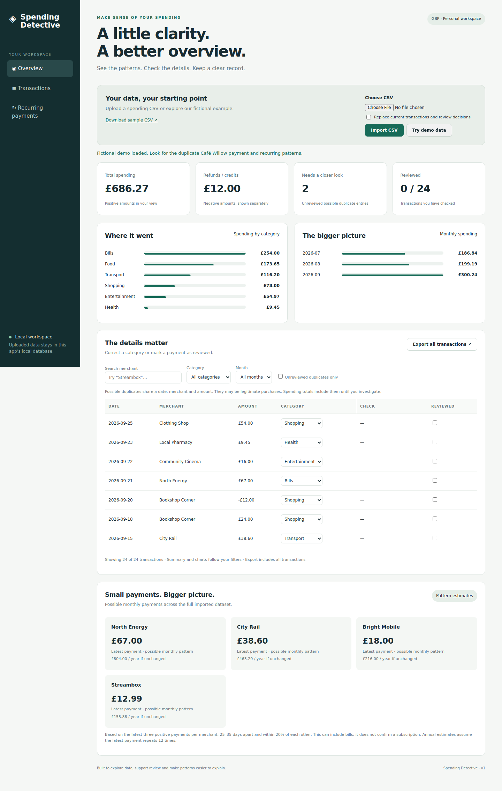

# Spending Detective

A local Python web app that turns a spending CSV into a dashboard, highlights possible duplicates, suggests categories and helps you record your review decisions.



## Why this project?

A list of transactions is difficult to review. This app combines data validation, charts and a small review workflow in one place. It is a portfolio learning project relevant to software development, data analysis, IT and audit support.

## What works in version 1

- Import a UTF-8 CSV containing up to 5,000 transactions (2 MB request limit).
- Explore fictional demo data with one click.
- Filter by merchant, category, month or unreviewed possible duplicates.
- View positive spending and negative refunds separately, category and month charts.
- Find entries with the same date, normalised merchant name and amount.
- Find possible monthly patterns using the latest three distinct payments per merchant.
- Correct categories and mark individual entries reviewed; SQLite saves those changes.
- Export all transactions and review flags to a CSV report.
- Use the dashboard on desktop or a smaller screen.

Receipt image upload/OCR, bank connections, login and deployment are future work, not implemented features. This is a single-user local app. It does not identify fraud or provide financial advice.

## Run on a Mac

Install Python 3.10 or newer if it is not already available. Unzip the project and open Terminal in its folder. Then run:

```sh
python3 -m venv .venv
source .venv/bin/activate
python -m pip install -r requirements.txt
python app.py
```

Open **http://127.0.0.1:5050** in your browser. Click **Try demo data**. Keep Terminal open while using the app. Press **Control+C** in Terminal to stop it.

## Run on Windows

Open PowerShell in the extracted project folder:

```powershell
py -m venv .venv
.\.venv\Scripts\python.exe -m pip install -r requirements.txt
.\.venv\Scripts\python.exe app.py
```

Open the same browser address above.

## CSV format

```csv
date,merchant,amount,category
2026-09-01,Streambox,12.99,Entertainment
2026-09-02,Bookshop Corner,-12.00,Shopping
```

- Required headers: `date`, `merchant`, `amount`. Optional header: `category`.
- Dates: `YYYY-MM-DD`; amounts: plain GBP numbers, at most two decimal places. Positive means spending; negative means refunds/credits. Adapt bank exports to this convention first.
- Use one currency per file; version 1 displays GBP only.
- Categories: Food, Transport, Shopping, Bills, Entertainment, Health, Other. Blank or absent categories use simple merchant keyword suggestions.
- Only those four columns are accepted. The sample is fictional and contains no account numbers.
- Each import replaces all previous entries and review decisions after validation. The UI asks you to confirm. Invalid files leave the previous dataset untouched.

## What the flags mean

**Possible duplicate:** same date, case/whitespace-normalised merchant and amount. All matching entries get a flag. Repeated real purchases can match this rule. Review does not remove entries or subtract them from totals.

**Possible monthly pattern:** the latest three distinct positive payments for a merchant are 25–35 days apart, with the largest amount at most 20% higher than the smallest. Annual cost is the latest payment × 12. Bills and transport can match; these are not confirmed subscriptions. This heuristic does not distinguish multiple subscriptions at the same merchant or detect every payment pattern.

Summary cards and charts follow the filters. Recurring patterns and exports cover the full dataset. Charts total positive amounts; refunds are shown separately.

## Data and security choices

Data stays in `instance/spending.sqlite` on the machine running the app. No external analytics, fonts, chart CDN or bank API is used. Data is not encrypted at rest. Use fictional data for public demonstrations; do not upload real financial records or the local database to GitHub.

The app binds to localhost with debugging disabled. It has no login or user isolation and is not ready for internet hosting. POST requests require a session CSRF token. SQL updates use parameters; merchant values are rendered as text rather than HTML. A content security policy restricts scripts and frames. Exported merchant names beginning with formula markers are prefixed to reduce spreadsheet formula injection risk.

Flask upload handling reference: https://flask.palletsprojects.com/en/stable/patterns/fileuploads/

## Tests and a demo you can explain

```sh
python -m unittest -v
```

Eight automated tests passed. Browser checks also passed for demo loading, upload, filters, review/category persistence, export and a 390px mobile viewport.

Tests cover validation, preservation of previous data on invalid import, CSRF, confirmation, review updates, duplicate/recurring rules and safe CSV exports.

For an interview or screen recording:

1. Load demo data and explain the spending/refund convention.
2. Filter to unreviewed duplicates and show the two Café Willow entries.
3. Mark one reviewed. Explain why this does not prove the other is incorrect.
4. Change a category, refresh, and show that the decision is saved.
5. Show recurring patterns and explain why City Rail can match without being a subscription.
6. Export the report. Describe how you would improve the heuristic and add receipt scanning.

## Files

- `app.py`: routes, SQLite persistence, request protections and exports.
- `analysis.py`: CSV validation, suggestions and analysis rules.
- `templates/index.html`: dashboard structure.
- `static/`: responsive CSS and browser interactions.
- `sample-data/demo.csv`: 24 fictional transactions.
- `test_app.py`: automated tests.

